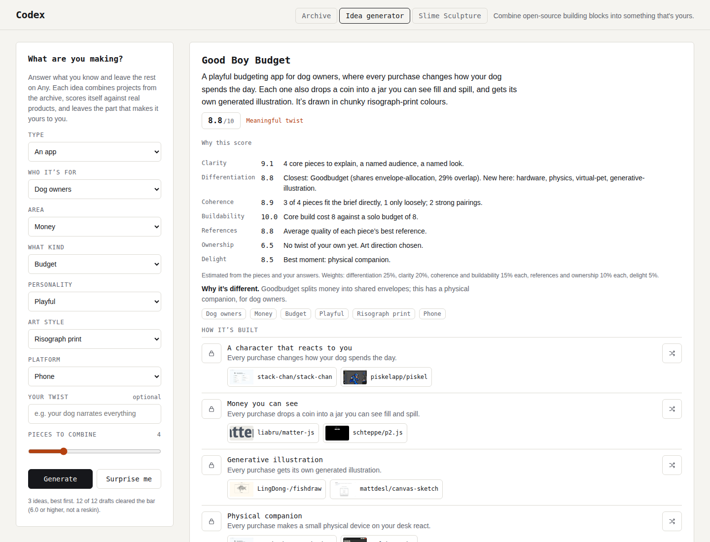
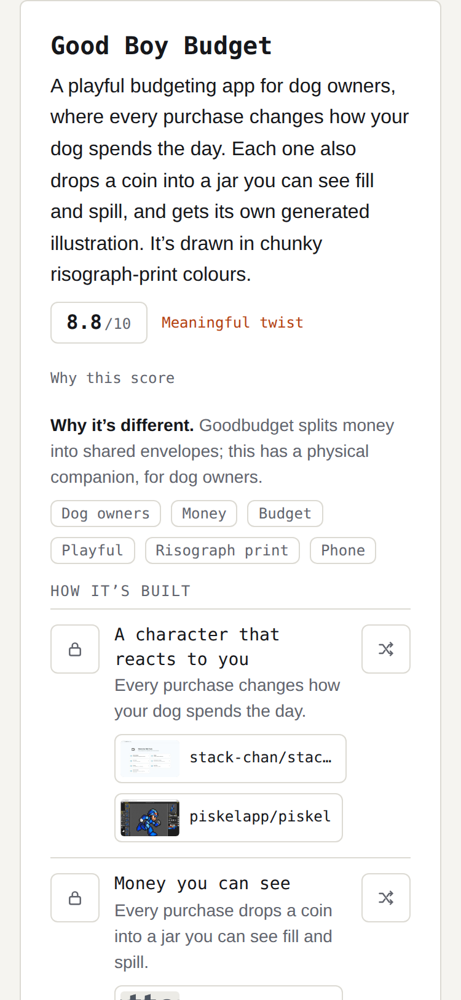
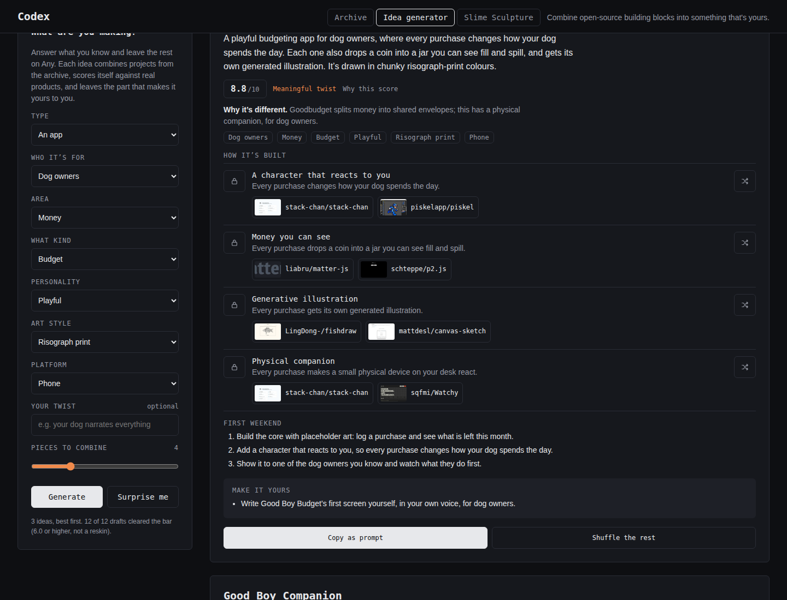

# Idea generator review — 24 September 2026

Run with [`prompts/idea-review.md`](../../prompts/idea-review.md). Reviewed the live generator on ten
briefs (twelve runs including three "Surprise me"), scored every idea, fixed what the review found,
and re-ran every brief on the fixed version.

## What was wrong

Read as a design critique of the old output (the full text of every old idea is in the review
notes; the dog-finance brief is quoted here):

> **Bright Chart.** A playful budget app for money on phone, where your own data becomes clean,
> live charts, trees grow procedurally and sway in the wind, and rolling marbles play the soundtrack.

1. **The pitch was hook soup.** One sentence chained three unrelated features with "and", so
   nothing stood out and a stranger couldn't repeat what the product *does*.
2. **Broken grammar in 8 of 12 runs:** "a budget app for money on phone", "a month or more
   portfolio piece".
3. **No audience, no look.** There was no way to say "for dog owners" or "in risograph", so every
   finance idea was a budgeting app with toys on top: Rocket Money or YNAB, reskinned.
4. **Block soup.** Pieces were chosen by loose tag matches with no idea of what belongs together:
   real molecules in a journal, live satellites in a fantasy shooter, a 1993 raycaster *and*
   comic-book shading *and* Three.js in one game, a music sequencer in a security tool.
5. **No sense of scope.** An eight-piece shooter stacked rollback netcode, VR, an ECS and a dungeon
   generator for one person.
6. **Duplicates and meaningless titles.** "Bright Chart" twice, "Plain Type" twice, "Second Neurons",
   "Field Horizon".
7. **Nothing said why it was different, or whether it was any good.**
8. **Interface:** "Building blocks" was jargon; icon buttons were 32px; "Copy as prompt" carried no
   summary; the page opened on a generic brief rather than a strong example.

## What changed

- **A 2–3 sentence summary on every idea**: what it is and who it's for, the signature action
  ("every purchase changes how your dog spends the day"), then how it looks. Whole-product pieces
  (looks, worlds, interfaces) move to the last sentence instead of being forced into actions.
- **New questions:** *Who it's for* (16 audiences), *Art style* (12 named styles) and *Your twist*
  in your own words. Audience comes first, because it changes every later answer.
- **Comparison against real products:** `data/comps.json`, 52 domains and 122 products (Rocket
  Money, YNAB, Finch, Forest, Minecraft, Noita, CyberChef…), each with defining traits. Every idea
  shows its closest product, what it shares, what's new, and a verdict: *new*, *meaningful twist*
  or *reskin*. Novelty only counts when it comes from a piece that belongs in the brief.
- **A score on every idea**, 0–10 on the review rubric, with the breakdown and evidence behind
  "Why this score". It's labelled as an estimate from the pieces and answers.
- **A quality gate:** 12 drafts per request, scored; reskins are never shown; the best three
  distinct ideas are kept. If fewer pass, the page says why.
- **Core and later:** past four pieces, the rest go under "Later, once the core works", so big
  ideas stay buildable and explainable.
- **Coherent picking:** at most one loosely-fitting wildcard per idea; one world structure and one
  render style per idea; pieces that pair well are favoured; pieces that clash with the brief
  (a sequencer in a budget app) are excluded.
- **First weekend** (three steps from placeholder core to a real person using it) and **Make it
  yours** prompts written for the specific idea.
- **Seven new pieces** for thin areas: a reacting character, money you can see, receipt snapping,
  an outfit builder, 3D garments, readable diffs, a branching story. Pieces without a vetted
  archive reference say so and name what to scout for.
- **Interface:** 40px tap targets, plain labels ("Pieces to combine", "Shuffle the rest"), unique
  titles, status messages for every action, a copy-as-prompt that carries the summary, score,
  comparison and first weekend, and share links that include the new answers (old links still open).

## Scorecard

Every idea before and after, scored by the same scorer. The scorer judges the *pieces* and the
answers, not the old text, so the "before" numbers are generous: they don't see the broken
grammar and hook-soup pitches above.

| Brief | Before | After | Lowest after | Reskins shown |
|---|---|---|---|---|
| 1 Dog finance | 7.8 | 8.2 | 8.1 | 0 → 0 |
| 2 Journal | 7.7 | 8.0 | 7.9 | 0 → 0 |
| 3 Storefront | 7.6 | 8.0 | 7.9 | 0 → 0 |
| 4 Fantasy shooter | 7.3 | 7.6 | 7.4 | 0 → 0 |
| 5 Cozy puzzle | 7.8 | 8.3 | 8.1 | 0 → 0 |
| 6 Eerie body art | 7.9 | 8.3 | 8.1 | 0 → 0 |
| 7 Weekend graphics | 6.7 | 7.6 | 7.5 | 0 → 0 |
| 8 Launch site | 6.4 | 7.0 | 7.0 | 1 → 0 |
| 9 Security tool | 5.0 | 7.2 | 7.0 | 3 → 0 |
| 10 Surprise #1 | 7.5 | 7.9 | 7.7 | 0 → 0 |
| 10 Surprise #2 | 6.7 | 7.3 | 7.2 | 0 → 0 |
| 10 Surprise #3 | 7.5 | 7.5 | 7.5 | 0 → 0 |
| **All ideas** | **7.14** | **7.76** | **7.0** | **4 → 0** |

| Criterion | Before | After |
|---|---|---|
| Clarity | 6.9 | 6.7 |
| Differentiation | 7.6 | 8.2 |
| Coherence | 6.9 | 8.5 |
| Buildability | 9.3 | 9.7 |
| References | 7.8 | 8.0 |
| Ownership | 4.3 | 4.3 |
| Delight | 7.8 | 8.0 |

Targets from the prompt: average at least 7.5 (met: 7.76), no shown idea under 6.0
(met: lowest 7.0), no reskins (met). Clarity and ownership barely move because most
test briefs leave *Who it's for*, *Art style* and *Your twist* on Any; answering them is worth
about +1.5 clarity and up to +5.5 ownership (see the dog-finance brief).

## The ten best ideas

Exactly as the page shows them.

1. **Pale Veins** (8.5, new; brief: Eerie body art)  
   An interactive 3D piece about the body, where every touch feeds a living slime that spreads across the screen. Each one also grows frost crystals across the screen, and is built from real molecules you can rotate.  
   *Why it's different:* Sandspiel is a falling-sand toy; this grows something alive from what you do.

2. **Sunday Companion** (8.4, new; brief: Cozy puzzle)  
   A 2D puzzle game set in a cozy world, where every solved room changes how a small companion character spends the day. Each one is also met by an AI that taught itself the rules.  
   *Why it's different:* Baba Is You changes the rules themselves; this makes you feel it through a character you care about.

3. **Good Boy Budget** (8.3, meaningful twist; brief: Dog finance)  
   A playful budgeting app for dog owners, where every purchase changes how your dog spends the day. Each one also drops a coin into a jar you can see fill and spill, and reveals a little more of the world.  
   *Why it's different:* Goodbudget splits money into shared envelopes; this makes you feel it through a character you care about, for dog owners.

4. **Sunday Tiles** (8.3, new; brief: Cozy puzzle)  
   A 2D puzzle game set in a cozy world, where every solved room changes how a small companion character spends the day. Each one also builds the next level from hand-made tiles.  
   *Why it's different:* Baba Is You changes the rules themselves; this makes you feel it through a character you care about.

5. **Pale Paradox** (8.3, new; brief: Eerie body art)  
   An interactive 3D piece about the body, where every touch opens a room that is bigger inside than out. Each one also feeds a living slime that spreads across the screen, and grows a coral-like pattern.  
   *Why it's different:* Sandspiel is a falling-sand toy; this folds space.

6. **Sunday Companion** (8.2, new; brief: Surprise #1)  
   A 3D survival sandbox game set in a cozy world, where every block you place changes how a small companion character spends the day. Each one also grows a branch on a tree that sways in the wind, and branches the story. It’s shaped by today’s real weather.  
   *Why it's different:* Noita simulates every pixel as a material; this makes you feel it through a character you care about.

7. **Good Boy Companion** (8.1, meaningful twist; brief: Dog finance)  
   A playful budgeting app for dog owners, where every purchase changes how your dog spends the day. Each one also drops a coin into a jar you can see fill and spill, and updates clean, live charts.  
   *Why it's different:* YNAB gives every dollar a job in envelopes; this makes you feel it through a character you care about, for dog owners.

8. **Good Boy Grove** (8.1, meaningful twist; brief: Dog finance)  
   A playful budgeting app for dog owners, where every purchase changes how your dog spends the day. Each one also grows a branch on a tree that sways in the wind, and logs itself from a photo of the receipt.  
   *Why it's different:* Rocket Money tracks subscriptions and bills from your bank; this makes you feel it through a character you care about, for dog owners.

9. **Painted Journal** (8.1, new; brief: Journal)  
   A creative journaling app, where every entry makes a small physical device on your desk react. Each one also changes how a small character who lives in the app spends the day, and gets its own generated illustration.  
   *Why it's different:* Day One keeps a private photo journal; this has a physical companion.

10. **Painted Store** (8.1, new; brief: Storefront)  
   A creative shopping app, where every product can be spun and draped in 3D. Each one also stretches, drapes or tears like fabric, and can be dragged and layered into an outfit. It’s wrapped in panels of liquid glass.  
   *Why it's different:* A Shopify theme sells products with a catalogue and checkout; this shows clothes as 3D pieces.

## The worst idea it still produces

**Plain Scroll** (7, brief: Launch site)

> A minimal website for a product launch, where every scroll can knock the page itself apart. Each one also moves the story forward. It’s wrapped in panels of liquid glass and choreographed like a film.

*Why it's different:* Apple product pages tell product stories as you scroll; this lets you wreck the page.

It clears the bar on paper, but a design lead wouldn't forward it. None of its behaviours is the
reason someone would open it, and its brief has few pieces tagged for it, so the generator runs out
of strong options fast. The fix is more pieces for that area, not a looser gate.

## What's still weak

- **The score is an estimate.** It's computed from the pieces' data and your answers, not from
  judging the finished product, and it can't hear how a sentence sounds. Treat 7 vs 8 as "both
  good", not as a ranking to trust to one decimal.
- **Thin catalogues:** launch sites, tools and fashion have fewer pieces than games and art, so
  their ideas repeat. Scout more repos for them and add pieces to `data/features.json`.
- **Some pieces have no vetted reference yet** (receipt scanning, branching story). The page says
  so and names what to scout.
- **Same-audience titles repeat their first word** ("Good Boy Budget", "Good Boy Jars"). That's
  deliberate branding, but a longer word list would help.

## Screenshots

Desktop with the score breakdown open, phone at 375px, and dark mode.

